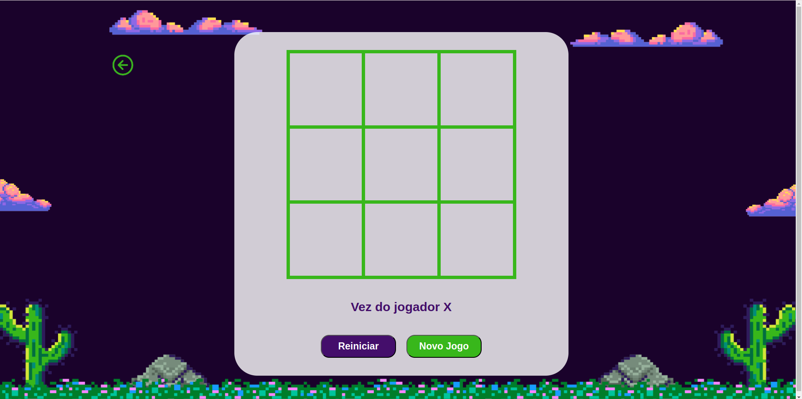
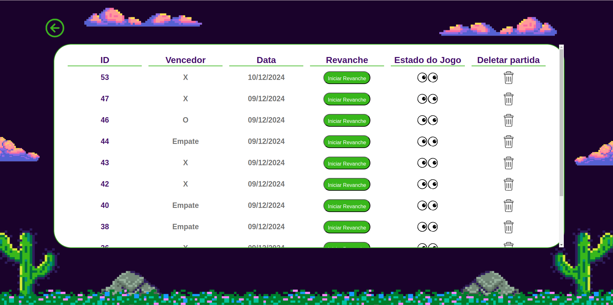

# Jogo da Velha - Frontend

Este é o frontend da aplicação "Jogo da Velha", desenvolvida com Vue.js. Ele é responsável por fornecer uma interface interativa para os usuários jogarem e visualizarem o histórico de partidas, consumindo os dados fornecidos por um backend em [Ruby on Rails](https://github.com/LuMedeir/Jogo_da_Velha-backend).

## Funcionalidades
 - Jogar partidas de Jogo da Velha.
 - Visualizar o estado de cada partida concluída.
 - Excluir partidas do histórico.
 - Exibir informações do vencedor ou empate.
 - Visualizar a data em que aquela partida foi jogada.
 - Obter uma revanche de uma partida específica.

## Pré-requisitos
Antes de executar o frontend, certifique-se de ter o seguinte instalado:

 - Node.js (versão 18.19.1 ou superior)
 - npm
 - O backend da aplicação, certifique-se de seguir o passo a passo do [link](https://github.com/LuMedeir/Jogo_da_Velha-backend) e ter a aplicação rodando.


## Como Jogar
Como Rodar o Projeto

 1. Clone o repositório:
   ```bash
      git clone https://github.com/LuMedeir/Jogo_da_Velha-frontend.git
      cd jogo-da-velha-frontend
   ```
2. Instale as dependências:
  ```bash
      npm install
   ```
3. Execute o projeto:
  ```bash
      npm run serve
   ```
5. Acesse o frontend: Abra o navegador e vá para [http://localhost:8080](http://localhost:8080);

## Tecnologias Utilizadas
 - Vue.js 3: Framework JavaScript para o frontend.
  - Vue Router: Gerenciamento de rotas.
 -Axios: Para consumo de API REST.
 - CSS: Estilização customizada.

## Imagens do Jogo: 
<p align="center">
 Partida:
 <br></br>
</p>

 <p align="center">
 Histórico de partidas:
 
</p>
